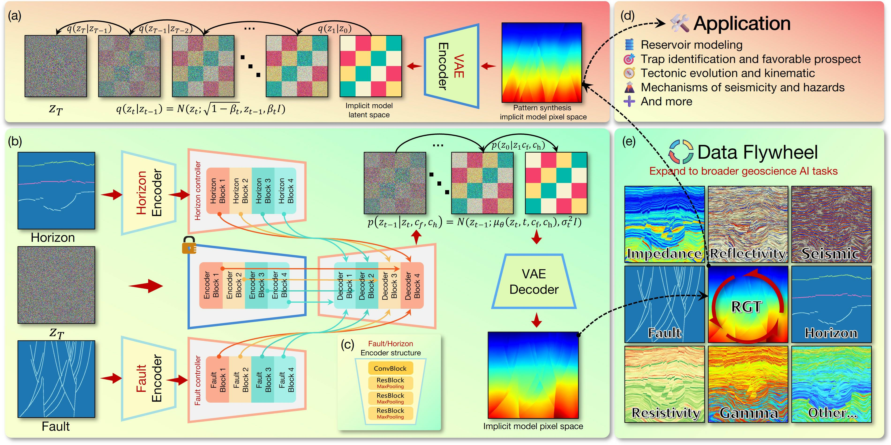
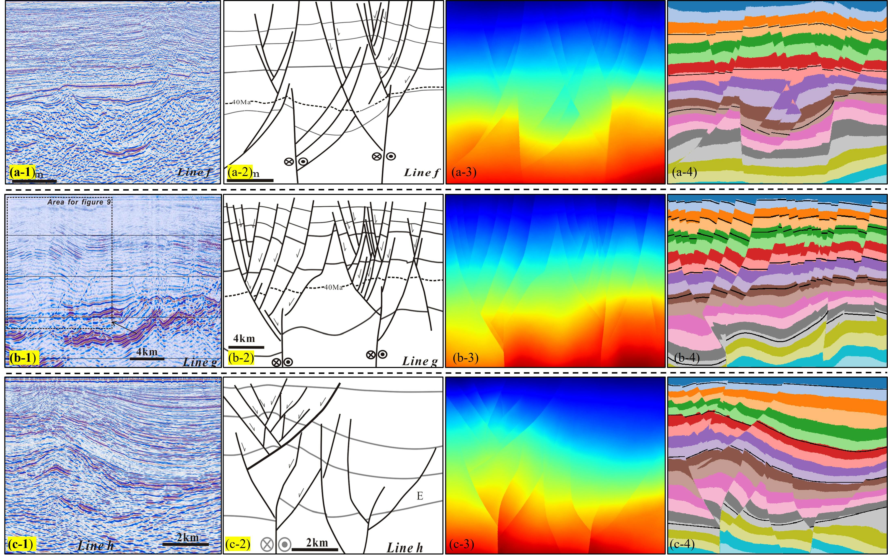
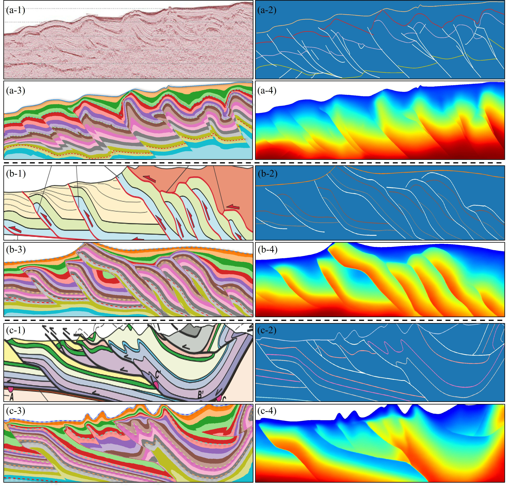
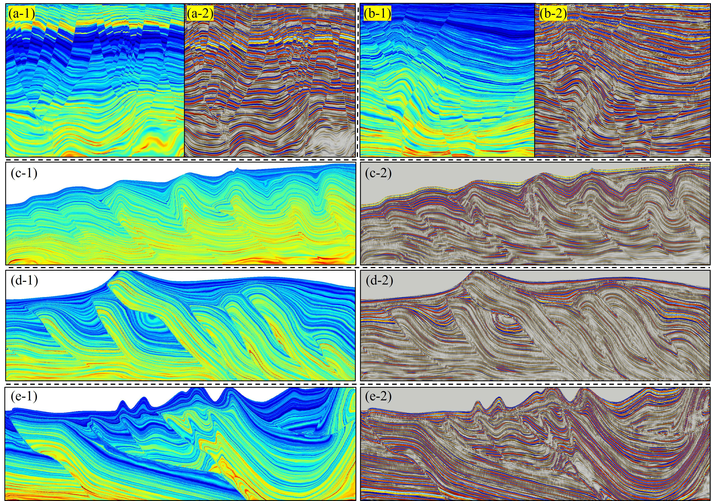

# Implicit Structural Modeling via Generative Diffusion Framework

Reference implementation for the paper *"Implicit Structural Modeling via
Generative Diffusion Framework"*. Given a sparse set of horizon constraints and
a fault skeleton, the model reconstructs a dense relative-geological-time (RGT)
scalar field with a conditional latent-diffusion network built on a Stable
Diffusion v2.1 backbone with two decoupled conditional branches (one for faults,
one for horizons).



*Overview of the framework: a latent diffusion model with two decoupled conditional
branches (faults and horizons) injected into a Stable Diffusion v2.1 backbone, with
the conditional encoder and the data-flywheel loop highlighted.*

## Repository layout

```
.
├── demo.py                 # single-shot inference demo (start here)
├── train.py                # training entry point (argparse, no hard-coded paths)
├── config.py               # global flags (e.g. save_memory)
├── share.py                # verbosity / sliced-attention setup
├── models/
│   ├── cldm_v21.yaml        # model config (SD v2.1 backbone)
│   └── cldm_v15.yaml
├── cldm/                   # conditional-control model + samplers
├── ldm/                    # latent-diffusion backbone (from Stable Diffusion)
├── assets/                 # figures used in this README
├── requirements.txt
└── LICENSE
```

The following large or data files are **not** shipped in the source tree and
must be downloaded from the data release (see *Data and weights* below):
model weights (e.g. `512x512.ckpt`), the fixed text-independent embedding
`clip_txt.npy`, and the example conditions under `val_data/`.

## Installation

```bash
conda create -n ism python=3.10 -y
conda activate ism
# install PyTorch matching your CUDA version first: https://pytorch.org
pip install -r requirements.txt
```

A CUDA GPU is recommended for inference; CPU works but is slow.

## Data and weights

Download the trained weights, the fixed embedding `clip_txt.npy`, and the
example validation inputs from the archived data release, and place them as:

```
512x512.ckpt                 # trained model weights
clip_txt.npy                 # fixed, text-independent cross-attention embedding
val_data/A_SSZ_horiz.npz     # example condition (arrays: 'horiz', 'fault')
```

`clip_txt.npy` is text-independent: the model does not take a textual prompt;
this fixed embedding is supplied only to satisfy the backbone's cross-attention
interface.

A condition `.npz` contains two arrays:

| key     | meaning                                                              |
|---------|---------------------------------------------------------------------|
| `horiz` | sparse horizon field in `[0, 1]`; `0` = unconstrained, `>0` = RGT iso-levels |
| `fault` | fault skeleton (binarised at `0.5` inside the code)                 |

## Quick start — inference demo

```bash
python demo.py \
    --cond     val_data/A_SSZ_horiz.npz \
    --ckpt     512x512.ckpt \
    --config   ./models/cldm_v21.yaml \
    --clip-txt clip_txt.npy \
    --strength 1.5 \
    --steps    50 \
    --seed     0 \
    --out      output/demo.png
```

This runs deterministic DDIM sampling (`eta=0`) for `--steps` steps and writes a
two-panel image: the reconstructed RGT field, and the same field with the input
horizon constraints overlaid. `--strength` sets the per-branch conditional
injection scale (the paper default is `1.5`).

## Training

Training and validation data are produced by the synthesis pipeline described in
the paper (procedural folding/faulting of a monotonic RGT field). Provide the
data directories and an initialisation checkpoint on the command line:

```bash
python train.py \
    --config     ./models/cldm_v21.yaml \
    --resume     weights/init.ckpt \
    --train-data /path/to/training_dataset \
    --val-data   val_data \
    --batch-size 16 \
    --lr         1e-5 \
    --gpus       0,1
```

`train.py` additionally requires the dataset modules `struc2rgtDataset.py`
(`seisDataset`) and `valDataset.py` (`valDataset`), which load the synthesised
training/validation samples; obtain them together with the dataset from the data
release.

## Reproducibility

Inference is deterministic for a fixed `--seed`, `--strength`, and `--steps`.
The results reported in the paper use `--strength 1.5` and `--steps 50`.

## Examples

Representative results produced by the model (see the paper for full details).

Field-derived strike-slip flower-fault sections:



Field-derived fold-thrust sections:



Data-flywheel examples — synthesized property models and the corresponding
forward-modeled seismic data:



## License and attribution

This code builds on Stable Diffusion / Latent Diffusion (`ldm/`) and ControlNet
(`cldm/`); their original licenses apply to the corresponding files. See
`LICENSE`. If you use this work, please cite the paper.
