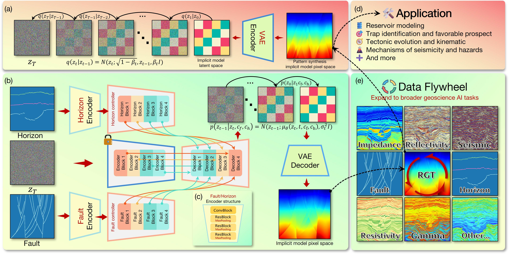
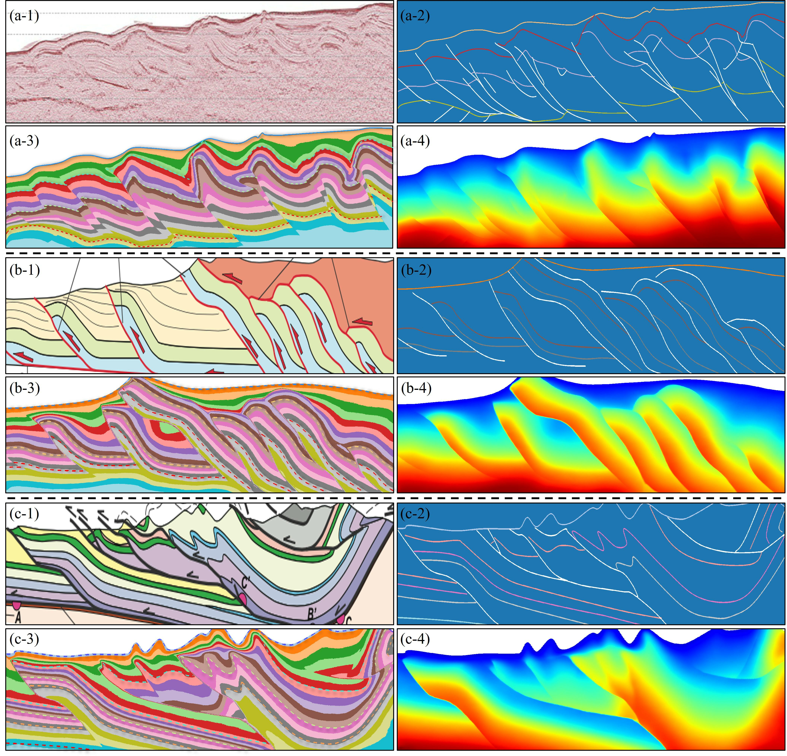
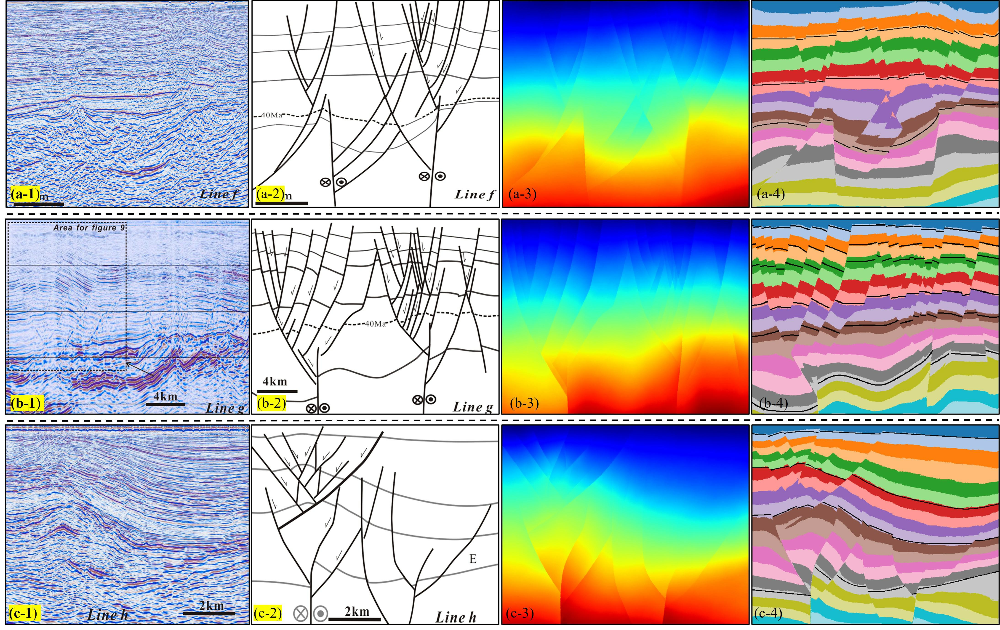

# Implicit Structural Modeling via Generative Diffusion Frameworks

Generate continuous relative geological time (RGT) fields from sparse faults and
horizons using a Stable Diffusion 2.1 backbone with independent conditioning branches.

**Yimin Dou, Xinming Wu, Zhixiang Guo, Hui Gao, and Buyu Deng**
University of Science and Technology of China

[Paper: arXiv:2606.07165](https://arxiv.org/abs/2606.07165) |
[ModelScope: data and weights](https://www.modelscope.cn/models/douyimin/ISMdiffusion/files) |
[Zenodo dataset](https://doi.org/10.5281/zenodo.18447817) |
[Test cases](test_data/)



## Installation

Python 3.10+ is required. Install [PyTorch and torchvision](https://pytorch.org/get-started/locally/)
for your CUDA version, then:

```bash
git clone https://github.com/douyimin/Implicit_Structural_Modeling_via_Diffusion.git
cd Implicit_Structural_Modeling_via_Diffusion
python -m pip install -r requirements.txt
python -m pip install -e . --no-deps
```

Run commands from the repository root. Required files download automatically
through the ModelScope API and are cached for reuse:

| File | Size | Used by |
| --- | --- | --- |
| `ISM_PretrainedModel.ckpt` | 6.72 GB | Inference and training |
| `RGTSYN.7z` | 2.37 GB; 8.4 GB extracted | Training |

Use `--cache-dir` to change the download cache and `--data-dir` to change the
training extraction directory (default: `data/modelscope/`).

## Inference

```bash
python inference.py --conditions test_data/flw0.npz --output outputs/flw0
```

Produces an RGT `.npz` and a preview `.png` using DDIM 50 steps with eta=0.
Add `--seed 42 --num-samples 200` for an ensemble, or `--device cpu` for CPU inference.
Use a new output directory for each run. Local weights can be selected with
`--checkpoint weights/ISM_PretrainedModel.ckpt`.

[`test_data/`](test_data/) includes 11 cases (`flw0`-`flw5`, `ssz0`-`ssz4`), with
[previews](test_data/snap/). Each NPZ contains:

| Array | Meaning |
| --- | --- |
| `fault` | Fault mask in `[0, 1]`, thresholded at `0.5` |
| `horiz` | Sparse horizon RGT values in `[0, 1]`; zero means unconstrained |

Both arrays must have the same `(H, W)` shape, with dimensions divisible by 64.
Some cases also contain stored `RGT_best` and `RGT_mean` results; inference uses
only the two condition arrays.

## Training

```bash
python train.py
```

Downloads and extracts the dataset, creates a **3600/200/200** split, and starts
training from the pretrained weights. Defaults: **2 GPUs, batch 25 per GPU**,
AdamW at `1e-5`, 200,000 steps, EMA `0.9996`. The VAE and UNet encoder/middle
remain frozen; the decoder and both condition branches are trained.
See [`configs/paper.yaml`](configs/paper.yaml) for all settings.

For a short single-GPU run:

```bash
python train.py --devices 1 --batch-size 1 --max-steps 10 --output runs/smoke
```

Resume weights, optimizer and EMA from a saved training checkpoint:

```bash
python train.py --resume runs/paper/checkpoints/last.ckpt --output runs/paper
```

For local data and weights, use `--data data/RGTSYN --init weights/ISM_PretrainedModel.ckpt`.
Training samples require `rgt` and `fault` arrays of shape `(512, 512)`.
Use `--split` for a custom split; resume otherwise reuses the saved split.
Pass the same `--data` directory when resuming a run that used local data.
Run either entry point with `--help` for more options.

## Examples

**Fold-thrust structures**, based on Butler and Bond (2020),
*Thrust systems and contractional tectonics*.



**Flower structures**, based on Huang and Liu (2017),
*Three types of flower structures in a divergent-wrench fault zone*.



## Citation and license

If you use this work, please cite:

```bibtex
@misc{dou2026implicitstructuralmodelinggenerative,
  title = {Implicit Structural Modeling via Generative Diffusion Frameworks},
  author = {Yimin Dou and Xinming Wu and Zhixiang Guo and Hui Gao and Buyu Deng},
  year = {2026},
  eprint = {2606.07165},
  archivePrefix = {arXiv},
  primaryClass = {physics.geo-ph},
  url = {https://arxiv.org/abs/2606.07165}
}
```

Original contributions use the [MIT license](LICENSE). This work builds on
ControlNet, Latent Diffusion, Stable Diffusion, and guided-diffusion;
see [third-party licenses and figure credits](THIRD_PARTY_NOTICES.md).
